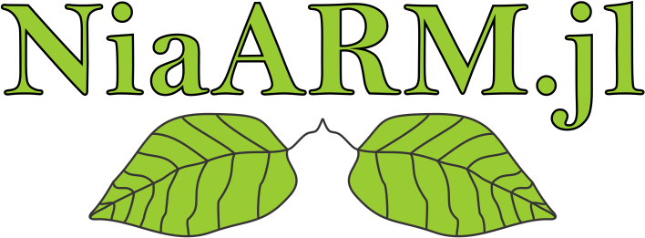

<h1 align="center">
  
</h1>


[](https://firefly-cpp.github.io/NiaARM.jl/stable)
[](https://firefly-cpp.github.io/NiaARM.jl/dev)
[](https://github.com/firefly-cpp/NiaARM.jl/actions/workflows/ci.yml)
[](https://github.com/JuliaDiff/BlueStyle)
[](https://github.com/JuliaTesting/Aqua.jl)

<p align="center">
  <a href="#-detailed-insights">✨ Detailed insights</a> •
  <a href="#-installation">📦 Installation</a> •
  <a href="#-usage">🚀 Usage</a> •
  <a href="#-reference-papers">📄 Reference papers</a> •
  <a href="#-related-frameworks">🔗 Related frameworks</a> •
  <a href="#-license">🔑 License</a>
</p>

NiaARM.jl is a Julia framework for mining numerical association rules based on nature-inspired algorithms for optimization. 🌿 Inspired by the [NiaARM](https://github.com/firefly-cpp/NiaARM) Python package, this package brings the power of numerical association rule mining to the Julia ecosystem. The current NiaARM.jl version supports the loading and preprocessing of datasets automatically, searching the numerical association rules and providing an output of identified association rules. 💻🔍 Similar to the original NiaARM implementation, numerical association rule mining is defined as an optimization problem and solved using population-based nature-inspired algorithms implemented within this framework.

## ✨ Detailed insights
The current version includes (but is not limited to) the following functions:

- loading datasets in CSV format 📂
- preprocessing of data 🔄
- searching for association rules 🔍
- providing an output of mined association rules 📝
- generating statistics about mined association rules 📊
- providing the implementation of several state-of-the-art nature-inspired algorithms for optimization 🧬

## 📦 Installation

```
pkg> add NiaARM
```

## 🚀 Usage

### Basic run example

```julia
using NiaARM, CSV, DataFrames

# read dataset from CSV file
transactions = CSV.read("dataset.csv", DataFrame)
# set stopping criterion
# there exist three stopping criteria: maxevals, maxiters, acceptable_fitness
criterion = StoppingCriterion(maxevals=5000)

# define metrics to use for fitness evaluation
# can use Vector{Symbol}, Vector{String}, or Dict{Symbol,Float64}
metrics = [:support, :confidence]  # equal weight for support and confidence

# call function for rule mining
# the second parameter is the name of the optimization algorithm
# for now, Bat Algorithm, Particle Swarm Optimization, Differential Evolution, Genetic Algorithm, Simulated Annealing and Random Search are implemented
rules = mine(transactions, de, criterion, metrics=metrics, seed=1234)

# print identified rules
for rule in rules
    println(rule)
end
```

## 📄 Reference papers

Ideas are based on the following research papers:

[1] Stupan, Ž., & Fister Jr., I. (2022). [NiaARM: A minimalistic framework for Numerical Association Rule Mining](https://joss.theoj.org/papers/10.21105/joss.04448.pdf). Journal of Open Source Software, 7(77), 4448.

[2] I. Fister Jr., A. Iglesias, A. Gálvez, J. Del Ser, E. Osaba, I Fister. [Differential evolution for association rule mining using categorical and numerical attributes](http://www.iztok-jr-fister.eu/static/publications/231.pdf) In: Intelligent data engineering and automated learning - IDEAL 2018, pp. 79-88, 2018.

[3] I. Fister Jr., V. Podgorelec, I. Fister. [Improved Nature-Inspired Algorithms for Numeric Association Rule Mining](https://link.springer.com/chapter/10.1007/978-3-030-68154-8_19). In: Vasant P., Zelinka I., Weber GW. (eds) Intelligent Computing and Optimization. ICO 2020. Advances in Intelligent Systems and Computing, vol 1324. Springer, Cham.

[4] I. Fister Jr., I. Fister [A brief overview of swarm intelligence-based algorithms for numerical association rule mining](https://arxiv.org/abs/2010.15524). arXiv preprint arXiv:2010.15524 (2020).

## 🔗 Related frameworks

[1] [NiaARM: A minimalistic framework for Numerical Association Rule Mining](https://github.com/firefly-cpp/NiaARM)

[2] [uARMSolver: universal Association Rule Mining Solver](https://github.com/firefly-cpp/uARMSolver)

[3] [niarules: Numerical Association Rule Mining using Population-Based Nature-Inspired Algorithms](https://github.com/firefly-cpp/niarules)

## 🔑 License

This package is distributed under the MIT License. This license can be found online at <http://www.opensource.org/licenses/MIT>.

## Disclaimer

This framework is provided as-is, and there are no guarantees that it fits your purposes or that it is bug-free. Use it at your own risk!
