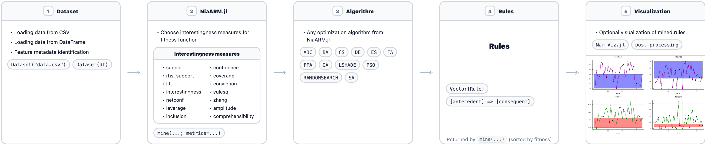

---
title: 'NiaARM.jl: A Julia Framework for Numerical Association Rule Mining Using Nature‑Inspired Optimization Algorithms'
tags:
  - Julia
  - numerical association rule mining
  - visualization
authors:
  - name: Žiga Stupan
    orcid: 0000-0001-9847-7306
    affiliation: 1 
  - name: Tilen Hliš
    orcid: 0000-0002-4973-4844
    affiliation: 1
  - name: Iztok Fister Jr.
    orcid: 0000-0002-6418-1272
    corresponding: true 
    affiliation: 1
affiliations:
  - name: University of Maribor, Faculty of Electrical Engineering and Computer Science
    index: 1
date: 7 December 2025
bibliography: paper.bib

# Summary

NiaARM.jl is an open-source Julia package for Numerical Association Rule Mining (NARM) based on stochastic population-based nature-inspired optimization algorithms [@telikani2020survey]. It brings the capabilities of the original Python-based NiaARM framework [@stupan2022niaarm] to the Julia ecosystem, enabling researchers and data scientists working with datasets with mixed attribute types (consisting of categorical and numerical attributes) to discover numerical association rules. NiaARM.jl supports loading datasets, preprocessing, association rule mining, and extraction of discovered rules with associated interestingness metrics. In line with the rule mining part, this package also implements several well-known stochastic population-based nature-inspired algorithms, such as Differential Evolution (DE) [@storn1997differential], Artificial Bee Colony (ABC) [@karaboga2007powerful], Particle Swarm Optimization (PSO) [@kennedy1995particle], and several other metaphor-based nature-inspired algorithms to act as solvers for the numerical association rule mining task. The entire numerical association rule mining workflow is further supported by visualization methods for numerical association rules, which is achieved through NarmViz.jl, a package well integrated with NiaARM.jl [@fister2024narmviz].

The flow of the NiaARM.jl framework is shown in \autoref{fig:NiaARM}. Users can construct a dataset either from a CSV file (via a file path) or directly from `DataFrame`. The dataset is then used to build the numerical association rule mining optimization problem together with user-selected interestingness measures, which are used in the computation of the fitness function. The optimization problem can be solved using any of the population-based nature-inspired algorithms implemented in NiaARM.jl (e.g., DE, ABC, PSO) to mine numerical association rules from the dataset. The discovered rules are returned as a collection of `Rule` objects and can be further analyzed, exported (e.g., to CSV in downstream post-processing), or visualized using NarmViz.jl [@fister2024narmviz], which provides several visualization methods for numerical association rules.

# Statement of need

Despite the growing importance of NARM in domains such as finance, sport, and medicine, the Julia ecosystem has lacked a dedicated and efficient framework for this task. NiaARM.jl fills this gap by providing a comprehensive, optimization-driven approach to numerical association rule mining based on stochastic population-based nature-inspired algorithms. The package enables researchers and data scientists to mine numerical association rules from mixed-type datasets while leveraging Julia’s strengths in performance, composability, and scientific computing. Altogether, the main benefits of NiaARM.jl can be summarized as follows:

- The framework enables researchers to easily apply the full NARM pipeline, i.e. from dataset loading to visualization of the identified rules.

- The package contains a vast collection of stochastic population-based nature-inspired algorithms.

- Julia’s performance allows for significantly faster discovery of numerical association rules compared to the Python version.

- The framework is designed in a modular way, allowing components to be flexibly combined and extended.

# References
